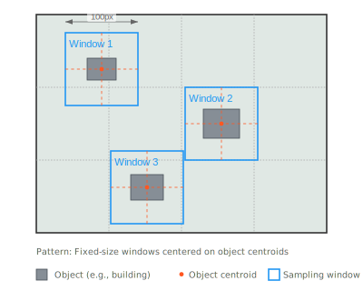

# Sampler

A Python package for creating samples for training Deep Learning models from Geo-referenced Raster & Vector dataset.

## Installation

```bash
pip install git+https://bitbucket.org/your-username/clipper.git
```

Requires Python >= 3.8, GDAL, and NumPy.

## Use Cases
The Clipper module is designed to support deep learning operations on large geospatial datasets, with two primary sampling methods:

1. Sliding Window Clipping

    - Systematically crops entire images into overlapping windows
    - Ideal for comprehensive analysis of complete geographic areas
    - Ensures no regions are missed during processing
    - Common in applications requiring full coverage analysis
    - Perfect for training data preparation where all regions are equally important


2. Object-Centered Clipping

    - Crops images around specific object locations using their centroid coordinates
    - Uses auxiliary vector files to identify object locations
    - Perfect for targeted analysis where only specific features matter
    - Optimizes processing by focusing only on areas of interest
    - Ideal for object detection, classification, or segmentation tasks



Multi-Layer Processing

Clipper excels at coordinated processing of multiple data layers:

Maintains consistent clipping across different raster datasets
Aligns multiple data sources using a base reference raster
Supports synchronized sample generation from multiple overlaid datasets
Ensures spatial consistency across all extracted samples
Enables efficient preparation of multi-channel training data
Perfect for applications requiring analysis of multiple co-registered datasets


## Key Concepts
### Base Raster
<div style="background-color: #2d3748; color: #90cdf4; padding: 10px;">
The base raster is a reference dataset that defines:

Coordinate Reference System (CRS)
Spatial extent
Pixel size/resolution

It's used to ensure all clipping operations maintain consistent:

Spatial reference
Resolution
Geographic boundaries</div>

### Output Formats
<div style="background-color: #2d3748; color: #90cdf4; padding: 10px;">Two output formats are available:

"array" (NumPy Array):

Returns data as a NumPy array
Good for further processing in Python
No geographic information retained
Memory efficient
Example use: ML model input preparation


"geocoded" (GeoTIFF):

Returns data as a GDAL dataset
Preserves geographic information
Suitable for GIS applications
Can be saved directly as GeoTIFF
Example use: Creating new georeferenced files</div>

## Modules

### 1. clippers.py

Contains `RasterClipper` and `VectorClipper` for basic clipping operations.

#### RasterClipper
For clipping raster datasets using coordinates or center points.

```python
from clipper import RasterClipper

# Initialize with a raster file
clipper = RasterClipper("input.tif")

# 1. Clip by geographic coordinates
result = clipper.clip_by_coords(
    geo_bbox=(minx, maxy, maxx, miny),  # Geographic bounds
    output_format="array",  # or "geocoded"
    save_output=True,
    output_path="output1.tif"
)

# 2. Clip by center point
result = clipper.clip_by_center(
    center_geo_x=435000,  # Center X coordinate
    center_geo_y=4532000,  # Center Y coordinate
    bbox_width=100,       # Width in pixels
    bbox_height=100,      # Height in pixels
    output_format="geocoded"
)

# 3. Clip by pixel coordinates
result = clipper.clip_by_pixels(
    pixel_bbox=(100, 100, 200, 200),  # (x1, y1, x2, y2)
    output_format="array"
)
```

#### VectorClipper
For clipping and rasterizing vector datasets.

```python
from clipper import VectorClipper

# Initialize with a vector file
clipper = VectorClipper("input.shp")

# 1. Clip by coordinates and rasterize
result = clipper.clip_by_coords(
    geo_bbox=(minx, maxy, maxx, miny),
    pixel_size=0.25,        # Output pixel size
    burn_value=1,         # Value for vector features
    output_format="array" # or "geocoded"
)

# 2. Clip by center point
result = clipper.clip_by_center(
    center_geo_x=435000,
    center_geo_y=4532000,
    bbox_width=100,
    bbox_height=100,
    pixel_size=0.25,
    output_format="geocoded"
)
```

### 2. samplers.py

Contains classes for batch processing and window generation.

#### BaseSampler
Base class that provides core single-operation clipping functionality:

- Handles individual raster and vector clipping operations
- Validates spatial references and coordinates
- Manages GDAL resources efficiently
- Returns clipped data as arrays or GDAL datasets
- Suitable when you need:
    - Designed for processing one coordinate at a time, making it inefficient for bulk operations due to lack of parallel processing capabilities.
    - Direct access to clipped data in your code
    - Memory-efficient single operations
    - Integration with other processing workflows

```python
from sampler import BaseSampler

# Initialize with base raster
sampler = BaseSampler("base.tif")

# Get clipped data for further processing
clipped_array = sampler.clip_raster(
    raster_path="input.tif",
    coords=(minx, maxy, maxx, miny),
    output_format="array"
)

# Process vector data
vector_array = sampler.clip_vector(
    vector_path="input.shp",
    coords=(minx, maxy, maxx, miny),
    pixel_size=0.25,
    burn_value=1
)
```

#### Sampler (inherits BaseSampler)
Extends BaseSampler with batch processing capabilities:

- Inherits all BaseSampler's single-operation features
- Adds parallel processing support
- Handles multiple files efficiently
- Includes progress tracking
- Suitable for:
    - Batch processing multiple clips
    - Production workflows
    - Large-scale data processing


*Note* :  Since the Sampler class inherits from BaseSampler, you can use either its batch processing methods (clip_vectors) for efficient parallel processing of multiple coordinates, or its single-operation methods (clip_vector) when you need direct access to clipped data within your workflow - all through a single unified interface.

```python
from sampler import SamplingWindowGenerator, Sampler

# Initialize with base raster
generator = SamplingWindowGenerator("base.tif")
sampler = Sampler("base.tif")

# 1. Generate sliding windows
coords, names = generator.sliding_window(
    window_size=256,  # Window size in pixels
    stride=128        # Step size in pixels
)

# 2. Batch process raster clips
sampler.clip_rasters(
    raster_path="input.tif",
    coordinates=coords,      # List of coordinate tuples
    names=names,            # List of output names
    output_dir="output",
    output_format="geocoded",
    n_workers=4             # Number of parallel processes
)

# 3. Batch process vector clips
sampler.clip_vectors(
    vector_path="input.shp",
    coordinates=coords,
    names=names,
    output_dir="output",
    pixel_size=0.25,
    burn_value=1,
    n_workers=4
)
```

## Author

Salar Ghaffarian (salar@myheat.ca)